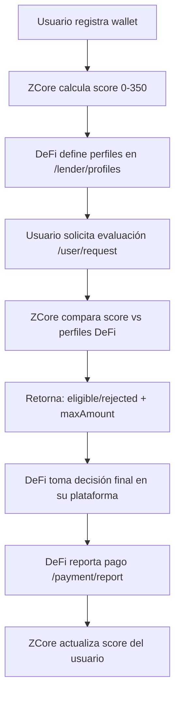

# Análisis de Endpoints ZCore - API de Scoring Intermediario

## ✅ **ANÁLISIS ACTUALIZADO: API COMPLETA PARA SU PROPÓSITO**

### **Completitud Funcional: 100%**

| Área Funcional             | Implementado | Necesario para Intermediario | Status          |
| -------------------------- | ------------ | ---------------------------- | --------------- |
| **Autenticación**          | 2/2          | 2/2                          | ✅ **COMPLETO** |
| **Scoring Stellar**        | 1/1          | 1/1                          | ✅ **COMPLETO** |
| **Evaluación vs Perfiles** | 1/1          | 1/1                          | ✅ **COMPLETO** |
| **Configuración DeFi**     | 1/1          | 1/1                          | ✅ **COMPLETO** |
| **Reporte de Pagos**       | 1/1          | 1/1                          | ✅ **COMPLETO** |
| **Perfiles de Usuario**    | 1/1          | 1/1                          | ✅ **COMPLETO** |

**Conclusión:** Para el rol de **intermediario de scoring**, la API actual tiene **TODOS los endpoints esenciales**.

---

## ⚡ **ZCore como Puente/Intermediario**

**ZCore NO es un prestamista** sino una **API de scoring intermediaria** entre:

- **DeFi Platforms** (prestamistas reales)
- **Usuarios** (solicitantes de crédito)

**Función:** Calcular score (0-350) desde Stellar blockchain y evaluar si el usuario califica según los perfiles que cada DeFi define.

---

## ✅ **Endpoints Actuales - FLUJO COMPLETO FUNCIONANDO**

| Endpoint                     | Método | Funcionalidad                        | Status          |
| ---------------------------- | ------ | ------------------------------------ | --------------- |
| `/api/auth/register`         | POST   | Registro con wallet Stellar          | ✅ **COMPLETO** |
| `/api/auth/login`            | POST   | Login con wallet                     | ✅ **COMPLETO** |
| `/api/user/request`          | POST   | Evaluación score vs perfiles DeFi    | ✅ **COMPLETO** |
| `/api/user/{wallet}/profile` | GET    | Obtener perfil de usuario            | ✅ **COMPLETO** |
| `/api/lender/profiles`       | POST   | DeFi define rangos de aprobación     | ✅ **COMPLETO** |
| `/api/payment/report`        | POST   | DeFi reporta pagos → actualiza score | ✅ **COMPLETO** |

---

## 🔄 **Flujo Intermediario (100% FUNCIONAL)**

**✅ Este flujo está COMPLETO y FUNCIONANDO** con los 6 endpoints actuales.

---

## 🎯 **Prioridades REVISADAS**

### **✅ MVP COMPLETO** (Ya implementado)

**Objetivo:** API funcional para intermediación de scoring

**Status:** ✅ **COMPLETADO** - Los 6 endpoints cubren todo el flujo:

1. Usuario se registra y obtiene score
2. DeFi configura perfiles de aceptación
3. Usuario solicita evaluación
4. API retorna eligible/rejected según score vs perfiles
5. DeFi reporta pagos para actualizar score
6. Usuarios pueden consultar su perfil

### **🟡 FASE 2 - Herramientas de Conveniencia** (Opcional)

**Objetivo:** Tools adicionales para mejorar UX de DeFi

**Endpoints opcionales:**

1. `GET /api/lender/{apiKey}/profiles` - Ver configuración actual
2. `PUT /api/lender/{apiKey}/profiles` - Actualizar perfiles
3. `GET /api/lender/{apiKey}/analytics` - Estadísticas de uso

### **🟡 FASE 3 - Utilidades Extra** (Opcional)

**Objetivo:** Debugging y transparencia adicional

**Endpoints opcionales:**

1. `GET /api/user/{wallet}/score/history` - Evolución histórica
2. `POST /api/user/{wallet}/recalculate` - Recálculo manual
3. `GET /api/utils/validate-wallet/{address}` - Validación previa

---

## ✅ **CONCLUSIÓN FINAL**

### **API Actual: COMPLETA para su Propósito**

**ZCore como intermediario de scoring tiene todos los endpoints necesarios:**

1. ✅ **Score calculation** - Automático desde Stellar
2. ✅ **Profile configuration** - DeFi define rangos
3. ✅ **Eligibility evaluation** - Score vs perfiles
4. ✅ **Score updates** - Via payment reports
5. ✅ **User management** - Registration y profile access

### **Endpoints Adicionales: NICE-TO-HAVE**

Los endpoints "faltantes" son **mejoras de conveniencia**, no **funcionalidad crítica faltante**:

- **Para DeFi:** Herramientas de gestión y analytics
- **Para Usuarios:** Transparencia adicional del score
- **Para Sistema:** Debugging y utilidades

### **Recomendación para Hackathon/MVP:**

**🎯 ENFOQUE:** Demostrar el flujo completo con los 6 endpoints existentes:

1. **Demo flow completo** funcionando
2. **Stellar integration** real con wallets de prueba
3. **Score calculation** transparente (0-350)
4. **Profile evaluation** con diferentes configuraciones DeFi
5. **Payment impact** en score evolution

**Los endpoints actuales son suficientes para una demostración convincente y un MVP real.**
