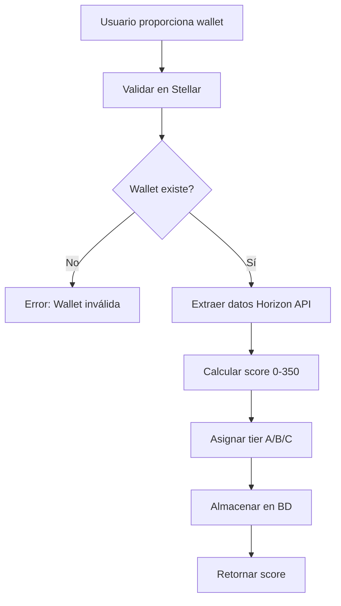

# Flujo del Sistema - Simplificado

## Casos de uso del usuario (cliente final)

1. **Se identifica con su wallet Stellar** - Proporciona dirección de wallet únicamente
2. **Sistema extrae datos automáticamente** - Horizon API obtiene historial on-chain
3. **Score generado instantáneamente** - Basado en actividad verificada de blockchain
4. **Recibe score calculado** - Máximo 350 puntos desde datos reales

## Casos de uso del prestamista (plataforma DeFi)

1. **Integra la API como proveedor de scoring** - Endpoints simplificados
2. **Solicita el scoring de un usuario específico** - Solo requiere wallet address
3. **Recibe el scoring verificado** - Score basado 100% en datos on-chain
4. **Verifica la autenticidad en blockchain** - Datos trazables en Stellar
5. **Decide otorgar el crédito** - Basado en score transparente y verificable

## Casos de uso de la API ZCore (intermediario)

1. **Recibe la wallet del usuario** - Validación de existencia en Stellar
2. **Extrae datos de Horizon API** - Automático, sin formularios
3. **Calcula score on-chain** - 6 componentes verificables (máx 350 pts)
4. **Proporciona score al prestamista** - Transparente y auditable
5. **Mantiene historial de comportamiento** - Actualizaciones por pagos

## Flujo Técnico Simplificado



## Endpoints Actualizados

### Registro de Usuario

```bash
POST /api/auth/register
{
  "walletAddress": "STELLAR_WALLET_ADDRESS"
}
# Respuesta: { "success": true, "data": { "score": 280 } }
```

### Login de Usuario

```bash
POST /api/auth/login
{
  "walletAddress": "STELLAR_WALLET_ADDRESS"
}
# Respuesta: { "success": true, "data": { "score": 280 } }
```

### Solicitar Score para Préstamo

```bash
POST /api/user/score
{
  "walletAddress": "STELLAR_WALLET_ADDRESS",
  "lenderId": "UUID",
  "requestedAmount": 5000
}
# Respuesta: Eligibilidad basada en score on-chain
```
