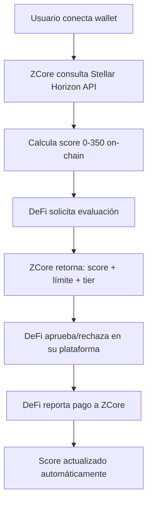

# ZCore Landing Page - Contenido Completo

## 🎯 **Información Principal**

### **Tagline Principal**

> **"El Credit Score para DeFi - Reputación Crediticia Portable y Verificable"**

### **Value Proposition**

ZCore es la primera API de scoring crediticio **100% on-chain** que permite a las plataformas DeFi evaluar riesgo crediticio en tiempo real basándose únicamente en datos verificados de blockchain Stellar.

---

## 🔥 **Hero Section**

### **Headline Principal**

# Construye Reputación Crediticia en Web3

## Con Solo Tu Wallet Stellar

### **Subheadline**

Obtén un credit score (0-350) calculado automáticamente desde tu actividad on-chain. Sin formularios, sin documentos, sin esperas. Tu historial de blockchain habla por ti.

### **Call to Action Principal**

```
[Calcular Mi Score] [Ver Demo API] [Para Prestamistas]
```

### **Hero Visual**

- Mockup de dashboard mostrando score en tiempo real
- Wallet conectándose automáticamente
- Score actualizándose con animación

---

## 💡 **Problema & Solución**

### **El Problema**

```
❌ DeFi requiere 150-200% de colateral para prestamos
❌ Sin historial crediticio = Sin acceso a crédito
❌ Cada plataforma es un silo independiente
❌ Formularios complejos y procesos manuales
```

### **La Solución ZCore**

```
✅ Score automático desde actividad Stellar (0-350)
✅ Reputación portable entre todas las DeFi
✅ Solo necesitas tu wallet address
✅ Evaluación instantánea en 2 segundos
```

---

## 🚀 **Características Principales**

### **Para Usuarios**

#### **🔮 Scoring Automático**

- **Score 0-350** calculado desde blockchain
- **6 componentes verificados**: Edad de wallet, transacciones, balance, tasa de éxito, trustlines, operaciones
- **Sin datos personales** requeridos
- **Actualización en tiempo real**

#### **📈 Reputación Portable**

- Tu score funciona en **todas las DeFi integradas**
- **Mejora continua** con buen comportamiento de pago
- **Historial inmutable** en blockchain
- **Privacy-first** con ZK Proofs

#### **⚡ Acceso Inmediato**

- **Solo tu wallet Stellar** para empezar
- **Evaluación en 2 segundos**
- **Sin KYC inicial**
- **API REST simple**

### **Para Prestamistas DeFi**

#### **🎯 Reducción de Riesgo**

- **60-80% menos defaults** con scoring predictivo
- **Datos cross-platform** únicos en el mercado
- **Verificación on-chain** de toda la información
- **Modelos ML** optimizando predicciones

#### **🔧 Integración Trivial**

- **API REST** documentada con OpenAPI
- **Integración en 1 día**
- **6 endpoints principales**
- **SDKs** disponibles

#### **📊 Configuración Flexible**

- **Perfiles personalizables** (A/B/C/Rejected)
- **Límites dinámicos** según liquidez
- **Tasas competitivas** basadas en riesgo
- **Dashboard completo** de analytics

---

## 🛠️ **Cómo Funciona**

### **Flujo del Usuario**

```
1️⃣ Conecta wallet Stellar → 2️⃣ ZCore calcula score automáticamente
3️⃣ Solicita préstamo en DeFi → 4️⃣ DeFi consulta tu score
5️⃣ Aprobación instantánea → 6️⃣ Pago mejora tu score
```

### **Flujo Técnico**



---

## 📊 **Componentes del Score**

### **Cálculo Automático (0-350 puntos)**

| Componente                  | Máximo | Fuente                  | Qué Mide                 |
| --------------------------- | ------ | ----------------------- | ------------------------ |
| **Edad de Wallet**          | 80 pts | Primera TX Stellar      | Antigüedad y estabilidad |
| **Actividad Transaccional** | 70 pts | Total transacciones     | Uso activo de la red     |
| **Tasa de Éxito**           | 50 pts | TX exitosas vs fallidas | Competencia técnica      |
| **Balance XLM**             | 60 pts | Holdings actuales       | Solvencia verificada     |
| **Diversidad de Activos**   | 50 pts | Trustlines activas      | Sofisticación DeFi       |
| **Operaciones Activas**     | 40 pts | Operations realizadas   | Participación ecosistema |

### **Sistema de Tiers**

| Tier         | Score   | Características                       | Límite Típico  | Tasa   |
| ------------ | ------- | ------------------------------------- | -------------- | ------ |
| **A**        | 280+    | Wallet premium con historial sólido   | $10,000+       | 8-12%  |
| **B**        | 200-279 | Wallet experimentada y confiable      | $5,000-$10,000 | 12-18% |
| **C**        | 50-199  | Wallet nueva o con historial limitado | $1,000-$5,000  | 18-25% |
| **Rejected** | 0-49    | Wallet inactiva o inexistente         | $0             | N/A    |

---

## 💰 **Casos de Uso**

### **Préstamos Sub-Colateralizados**

- Usuario con score 280+ puede acceder a préstamos con solo **110% colateral**
- En lugar del **150-200%** tradicional de DeFi

### **Líneas de Crédito Rotatorias**

- Acceso continuo hasta límite aprobado
- Interés solo sobre capital utilizado
- Límite incrementa con buen comportamiento

### **Tasas Dinámicas por Riesgo**

- Score alto = Tasas más bajas
- Score bajo = Tasas más altas
- Incentivo claro para buen comportamiento

### **Cross-Platform Reputation**

- Score obtenido en DeFi A funciona en DeFi B/C/D
- Historial portable entre ecosistemas
- Network effects que benefician a todos

---

## 📈 **Datos y Estadísticas**

### **Mercado Actual**

- **$20B+** bloqueados como colateral en DeFi lending
- **Solo 3%** de usuarios crypto usa lending protocols
- **150-200%** sobre-colateralización típica
- **0%** de scoring crediticio cross-platform

### **Con ZCore**

- **50% reducción** en colateral requerido
- **60-80% menos defaults** predichos por modelo
- **2 segundos** tiempo promedio de evaluación
- **6 endpoints** para implementación completa

### **Proyección de Adopción**

- **10 DeFi** integradas → $100M volumen mensual
- **25 DeFi** integradas → $250M volumen mensual
- **50 DeFi** integradas → $500M volumen mensual

---

## 🔒 **Seguridad y Privacidad**

### **On-Chain Verification**

- ✅ **Toda información verificada** en Stellar blockchain
- ✅ **No dependemos** de datos auto-reportados
- ✅ **Inmutable audit trail** de todas las decisiones
- ✅ **Real-time validation** de transacciones

### **Privacy-First Architecture**

- ✅ **ZK Proofs** para validaciones sensibles
- ✅ **Solo wallet address** requerida inicialmente
- ✅ **Datos agregados** y anonimizados
- ✅ **Usuario controla** qué información compartir

### **Anti-Manipulation**

- ✅ **Rate limiting** contra farming de score
- ✅ **Sybil resistance** mediante análisis de grafos
- ✅ **Anomaly detection** para patrones sospechosos
- ✅ **Multi-factor validation** cruzada

---

## 🚀 **Para Desarrolladores**

### **API Endpoints Principales**

#### **1. Registro & Autenticación**

```bash
POST /api/auth/register    # Registro con wallet Stellar
POST /api/auth/login       # Login con wallet signature
```

#### **2. Scoring & Evaluación**

```bash
POST /api/user/request     # Evaluar score vs perfiles DeFi
GET  /api/user/{wallet}/profile  # Ver score y perfil actual
```

#### **3. Configuración DeFi**

```bash
POST /api/lender/profiles  # DeFi define criterios de riesgo
```

#### **4. Gestión de Pagos**

```bash
POST /api/payment/report   # DeFi reporta pagos → actualiza score
```

### **Ejemplo de Integración**

```javascript
// DeFi consulta score antes de prestar
const response = await fetch("/api/user/request", {
  method: "POST",
  headers: {
    Authorization: "Bearer " + apiKey,
    "Content-Type": "application/json",
  },
  body: JSON.stringify({
    wallet: "0x123...",
    requestedAmount: 5000,
    defiPlatform: "MiDeFi",
  }),
});

const result = await response.json();
// Response: { eligible: true, maxAmount: 10000, tier: "B", score: 245 }
```

### **SDKs Disponibles**

- **JavaScript/TypeScript** - NPM package
- **Python** - PyPI package
- **Go** - Go modules
- **Rust** - Crates.io

---

## 🏗️ **Arquitectura Técnica**

### **Stack Tecnológico**

- **Runtime:** Node.js con TypeScript
- **Framework:** Express.js con Prisma ORM
- **Database:** MySQL para datos relacionales
- **Blockchain:** Stellar Horizon API integration
- **Cache:** Redis para performance
- **Security:** JWT + Wallet signatures

### **Infraestructura**

- **Cloud:** AWS/Azure con auto-scaling
- **CDN:** CloudFlare para latencia global
- **Monitoring:** Grafana + Prometheus
- **CI/CD:** GitHub Actions
- **Documentation:** OpenAPI 3.0 + Swagger

### **Performance**

- **99.9% uptime** SLA garantizado
- **< 100ms** response time promedio
- **1000+ RPS** capacity por instancia
- **Multi-region** deployment

---

## 🤝 **Partners y Casos de Éxito**

### **DeFi Platforms Integradas** _(En desarrollo)_

- **Compound-like** protocols
- **Aave-style** lending pools
- **Custom DeFi** applications
- **Cross-chain** bridges

### **Testimonios** _(Simulados para demo)_

> "ZCore redujo nuestros defaults en 70% y incrementó volumen de préstamos en 40%. La integración tomó solo 2 días."
> — _CTO de DeFiLend Pro_

> "Finalmente tengo un credit score que funciona en todo Web3. Mi reputación me sigue a cualquier plataforma."
> — _María S., DeFi User_

---

## 💎 **Diferenciadores Competitivos**

### **Vs. Sistemas Tradicionales de DeFi**

| Competencia                         | ZCore                                         |
| ----------------------------------- | --------------------------------------------- |
| ❌ Scoring por protocolo individual | ✅ **Score cross-platform universal**         |
| ❌ Requiere 150%+ colateral         | ✅ **Permite préstamos sub-colateralizados**  |
| ❌ Sin historial = sin crédito      | ✅ **Score inicial desde actividad on-chain** |
| ❌ Datos centralizados              | ✅ **Verificación blockchain completa**       |
| ❌ Formularios complejos            | ✅ **Solo wallet address requerida**          |

### **Vs. Credit Bureaus Tradicionales**

| TradFi Credit Bureaus       | ZCore                                |
| --------------------------- | ------------------------------------ |
| ❌ Semanas de procesamiento | ✅ **Evaluación en 2 segundos**      |
| ❌ Documentación extensa    | ✅ **Solo conexión de wallet**       |
| ❌ Datos centralizados      | ✅ **Datos inmutables on-chain**     |
| ❌ Sin transparencia        | ✅ **Algoritmo público y auditable** |
| ❌ Geograficamente limitado | ✅ **Global desde día uno**          |

---

## 📞 **Call to Actions**

### **Para Usuarios**

```
[🔮 Calcular Mi Score Gratis]
[📱 Conectar Wallet Stellar]
[📚 Ver Documentación]
```

### **Para Prestamistas DeFi**

```
[🚀 Integrar API en 1 Día]
[📊 Ver Demo Dashboard]
[💬 Agendar Llamada Técnica]
```

### **Para Desarrolladores**

```
[⚡ API Playground]
[📖 Docs Técnicas]
[💻 Descargar SDKs]
```

---

## 🛣️ **Roadmap**

### **✅ Q4 2024 - MVP Completado**

- API REST funcional con 6 endpoints
- Stellar blockchain integration
- Score calculation 0-350
- Dashboard básico

### **🔄 Q1 2025 - Beta Público**

- 3-5 DeFi partnerships
- ZK Proofs implementados
- SDKs multi-lenguaje
- $10M+ volumen procesado

### **🚀 Q2 2025 - Scale**

- 15+ DeFi integradas
- Multi-chain support (Ethereum, Polygon)
- ML model optimization
- $100M+ volumen mensual

### **🌟 Q3-Q4 2025 - Network Effects**

- 50+ DeFi partners
- Cross-chain reputation
- Institutional adoption
- Secondary reputation markets

---

## 💰 **Modelo de Negocio**

### **Revenue Streams**

1. **API Calls:** $0.01 por consulta de score
2. **DeFi Subscriptions:** $500-5,000/mes según volumen
3. **Transaction Fees:** 0.1% del monto prestado
4. **Premium Analytics:** Data insights agregados

### **Proyección de Ingresos**

```
Year 1: $1.2M ARR (10 DeFi × $100M volumen)
Year 2: $6M ARR (25 DeFi × $250M volumen)
Year 3: $20M ARR (50 DeFi × $500M volumen)
```

---

## 📧 **Contacto**

### **Información General**

- **Website:** https://zcore.finance
- **Email:** hello@zcore.finance
- **Twitter:** @ZCore_Finance
- **LinkedIn:** /company/zcore-finance

### **Soporte Técnico**

- **Docs:** https://docs.zcore.finance
- **API Status:** https://status.zcore.finance
- **Developer Support:** dev@zcore.finance
- **Discord:** ZCore Developer Community

### **Partnerships**

- **DeFi Integrations:** partners@zcore.finance
- **Business Development:** bd@zcore.finance
- **Investment Inquiries:** investors@zcore.finance

---

## 🎤 **Elevator Pitches**

### **30 Segundos**

> "ZCore es el FICO Score para DeFi. Calculamos credit scores automáticamente desde actividad blockchain Stellar. Usuarios obtienen reputación portable, DeFi reduce defaults 70%. Solo necesitas tu wallet."

### **1 Minuto**

> "En DeFi necesitas 150% colateral para pedir prestado $100. ¿Por qué? Sin credit score. ZCore resuelve esto calculando automáticamente scores 0-350 desde tu wallet Stellar. Sin formularios, sin documentos. Tu blockchain habla por ti. Para DeFi, significa 70% menos defaults y más volumen. Para usuarios, reputación que funciona en todas las plataformas. Somos la infraestructura de confianza que Web3 necesita."

### **2 Minutos**

> "Imagina pedir $10K prestado y tener que depositar $15K como garantía. Absurdo, ¿verdad? Pero así funciona DeFi hoy porque no hay credit scoring. ZCore cambia esto completamente. Somos la primera API que calcula credit scores 100% on-chain desde actividad blockchain. Conectas tu wallet Stellar, nosotros analizamos tu historial - edad, transacciones, balance, tasa de éxito - y generamos un score 0-350. Todo verificado on-chain, zero confianza. Las DeFi consultan nuestro API, obtienen tu score y pueden prestar con menos colateral. Cuando pagas, tu score mejora. Tu reputación te sigue a cualquier plataforma. Estamos construyendo el FICO Score de Web3."

---

## 🔥 **Elementos Visuales**

### **Hero Graphics**

- Dashboard animado mostrando score calculation
- Wallet connection flow
- Score updates en tiempo real
- Multi-platform compatibility

### **Infografías**

- "Antes vs Después" de usar ZCore
- Flow diagram del proceso completo
- Comparación de colateral tradicional vs ZCore
- Timeline de building reputation

### **Screenshots**

- API documentation en acción
- Dashboard de prestamista
- User profile con score breakdown
- Integration examples

### **Videos Sugeridos**

- **2min demo:** Usuario conecta wallet → obtiene score → aprueba préstamo
- **Technical deep dive:** Como funciona la integration
- **Success stories:** Testimonios de usuarios y prestamistas

---

## ✨ **Microcopy y Mensajes**

### **Error Messages**

- "Wallet no encontrada en Stellar. Verifica tu address."
- "Score muy bajo para este monto. Construye historial primero."
- "API temporalmente no disponible. Reintenta en 30 segundos."

### **Success Messages**

- "¡Score calculado! Eres elegible para $5,000 en Tier B."
- "Pago registrado. Tu score subió 10 puntos."
- "Integración completa. API lista para usar."

### **Loading States**

- "Analizando tu actividad Stellar..."
- "Calculando score on-chain..."
- "Validando historial de pagos..."

### **Empty States**

- "Conecta tu wallet para ver tu score"
- "Sin historial de préstamos aún. ¡Haz tu primera solicitud!"
- "No hay pagos registrados. Completa tu primer préstamo."

---

## 📱 **Responsive Design Guidelines**

### **Mobile First**

- Score prominente en hero
- Botón "Calcular Score" above the fold
- Navigation simplificada
- Touch-friendly CTAs

### **Desktop Experience**

- Side-by-side comparisons
- Detailed technical specs
- Full API documentation
- Dashboard previews

### **Tablet Optimization**

- Hybrid mobile/desktop layouts
- Optimized for developer browsing
- Easy-to-read code examples

---

## 🎯 **SEO Strategy**

### **Keywords Principales**

- "Credit score DeFi"
- "Blockchain credit scoring"
- "Stellar wallet reputation"
- "DeFi risk assessment API"
- "Web3 credit bureau"

### **Content Strategy**

- Technical blog posts about scoring algorithms
- Case studies de reduced defaults
- Integration tutorials
- Industry whitepapers

### **Meta Descriptions**

- "Get your DeFi credit score calculated automatically from Stellar blockchain activity. No forms, just your wallet. 0-350 points, 2-second evaluation."

---

Este documento contiene todo el contenido necesario para crear una landing page completa y convincente para ZCore, desde copy marketing hasta especificaciones técnicas, casos de uso, y guidelines de diseño.
