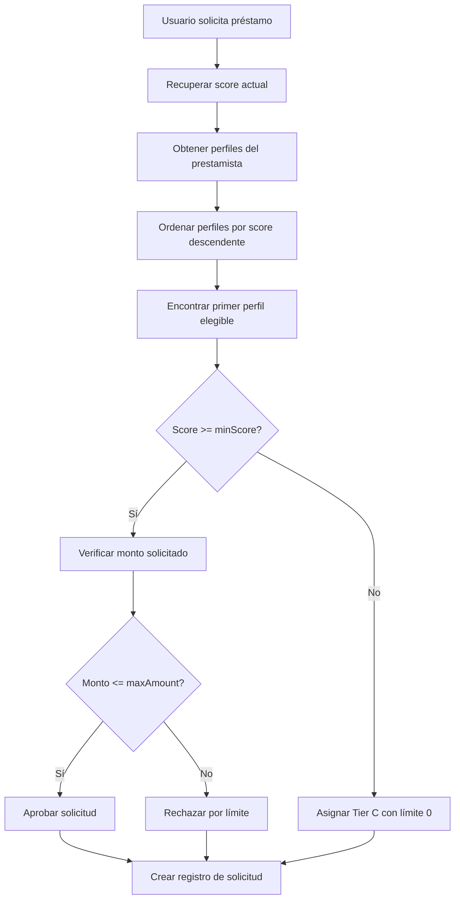

# Metodología de Scoring y Perfiles de Riesgo - ZCore

## Resumen Ejecutivo

ZCore utiliza un sistema de scoring crediticio adaptado para Web3 que evalúa la reputación financiera on-chain de usuarios mediante análisis de comportamiento de wallet y cuestionario auto-reportado. El score resultante (300-850, similar a FICO) determina la elegibilidad para préstamos sub-colateralizados y las condiciones ofrecidas.

---

## Arquitectura del Sistema de Scoring

### Componentes Principales

1. **Calculador de Score Inicial** - Evalúa datos del cuestionario
2. **Asignador de Perfiles** - Clasifica usuarios en tiers A/B/C
3. **Actualizador Dinámico** - Modifica score basado en comportamiento de pago
4. **Evaluador de Elegibilidad** - Determina aprobación y límites

---

## Cálculo del Score Inicial

### Variables de Entrada (Cuestionario)

| Variable           | Tipo   | Peso   | Descripción                          | Rango Típico                 |
| ------------------ | ------ | ------ | ------------------------------------ | ---------------------------- |
| `walletAge`        | number | 0.2    | Edad de la wallet en meses           | 0-60+                        |
| `averageBalance`   | number | 0.0001 | Balance promedio histórico           | 0-100000+                    |
| `transactionCount` | number | 0.1    | Número total de transacciones        | 0-1000+                      |
| `defiInteractions` | number | 5.0    | Interacciones con protocolos DeFi    | 0-50+                        |
| `monthlyIncome`    | number | 0.0005 | Ingreso mensual declarado            | 0-50000+                     |
| `loanPurpose`      | string | 0.0    | Propósito del préstamo (cualitativo) | "business", "personal", etc. |

### Fórmula de Cálculo

```javascript
const normalized =
  walletAge * 0.2 +
  averageBalance * 0.0001 +
  transactionCount * 0.1 +
  defiInteractions * 5 +
  monthlyIncome * 0.0005;

const rawScore = SCORE_MIN(300) + normalized;
const finalScore = Math.min(Math.max(Math.round(rawScore), 300), 850);
```

### Ejemplos de Scoring

**Usuario Principiante:**

- walletAge: 3 meses → 3 \* 0.2 = 0.6
- averageBalance: $500 → 500 \* 0.0001 = 0.05
- transactionCount: 10 → 10 \* 0.1 = 1.0
- defiInteractions: 2 → 2 \* 5 = 10.0
- monthlyIncome: $3000 → 3000 \* 0.0005 = 1.5
- **Score Final:** 300 + 13.15 = **313 (Tier C)**

**Usuario Intermedio:**

- walletAge: 18 meses → 18 \* 0.2 = 3.6
- averageBalance: $5000 → 5000 \* 0.0001 = 0.5
- transactionCount: 150 → 150 \* 0.1 = 15.0
- defiInteractions: 20 → 20 \* 5 = 100.0
- monthlyIncome: $8000 → 8000 \* 0.0005 = 4.0
- **Score Final:** 300 + 123.1 = **423 (Tier C)**

**Usuario Avanzado:**

- walletAge: 36 meses → 36 \* 0.2 = 7.2
- averageBalance: $25000 → 25000 \* 0.0001 = 2.5
- transactionCount: 800 → 800 \* 0.1 = 80.0
- defiInteractions: 50 → 50 \* 5 = 250.0
- monthlyIncome: $15000 → 15000 \* 0.0005 = 7.5
- **Score Final:** 300 + 347.2 = **647 (Tier B)**

**Usuario Premium:**

- walletAge: 48 meses → 48 \* 0.2 = 9.6
- averageBalance: $100000 → 100000 \* 0.0001 = 10.0
- transactionCount: 1500 → 1500 \* 0.1 = 150.0
- defiInteractions: 80 → 80 \* 5 = 400.0
- monthlyIncome: $25000 → 25000 \* 0.0005 = 12.5
- **Score Final:** 300 + 582.1 = **850** _(limitado)_ **(Tier A)**

---

## Sistema de Perfiles de Riesgo

### Clasificación por Tiers

| Tier  | Score Mínimo | Características                                 | Límite Típico  | Tasa Típica |
| ----- | ------------ | ----------------------------------------------- | -------------- | ----------- |
| **A** | 750+         | Usuarios premium con historial sólido           | $10,000+       | 8-12%       |
| **B** | 650-749      | Usuarios experimentados con buen comportamiento | $5,000-$10,000 | 12-18%      |
| **C** | 300-649      | Usuarios nuevos o con historial limitado        | $1,000-$5,000  | 18-25%      |

### Lógica de Asignación

```javascript
export const assignProfileTier = (score: number) => {
  if (score >= 750) return "A";
  if (score >= 650) return "B";
  return "C";
};
```

---

## Actualización Dinámica del Score

### Eventos que Modifican el Score

| Evento              | Cambio en Score | Justificación                    |
| ------------------- | --------------- | -------------------------------- |
| **Pago puntual**    | +10 puntos      | Refuerza comportamiento positivo |
| **Default/No pago** | -30 puntos      | Penaliza incumplimiento          |

### Fórmula de Actualización

```javascript
export const updateScoreFromPayment = (score, status) => {
  const delta = status === "paid" ? 10 : -30;
  const updatedScore = Math.min(Math.max(score + delta, 300), 850);
  return {
    score: updatedScore,
    profileTier: assignProfileTier(updatedScore),
  };
};
```

### Ejemplos de Evolución

**Escenario de Mejora:**

- Usuario inicia con score 620 (Tier C)
- Realiza 5 pagos puntuales: 620 + (5 × 10) = 670 (Tier B)
- Mejora condiciones automáticamente

**Escenario de Deterioro:**

- Usuario tiene score 720 (Tier B)
- Defaultea 1 pago: 720 - 30 = 690 (mantiene Tier B)
- Defaultea otro: 690 - 30 = 660 (mantiene Tier B)
- Tercer default: 660 - 30 = 630 (baja a Tier C)

---

## Proceso de Evaluación de Elegibilidad

### Flujo de Evaluación



### Algoritmo de Matching

```javascript
export const evaluateEligibility = (score, profiles, requestedAmount) => {
  // Ordenar perfiles de mayor a menor score requerido
  const sortedProfiles = [...profiles].sort((a, b) => b.minScore - a.minScore);

  // Buscar el primer perfil que el usuario califique
  for (const profile of sortedProfiles) {
    if (score >= profile.minScore) {
      return {
        profileAssigned: profile.tier,
        maxAmount: profile.maxAmount,
        eligible: requestedAmount <= profile.maxAmount,
      };
    }
  }

  // Si no califica para ningún perfil
  return {
    profileAssigned: "C",
    maxAmount: 0,
    eligible: false,
  };
};
```

---

## Configuración de Prestamistas

### Ejemplo de Perfiles Típicos

```json
{
  "apiKey": "lender_xyz_12345",
  "name": "DeFi Lending Protocol",
  "profiles": [
    {
      "tier": "A",
      "minScore": 750,
      "maxAmount": 50000,
      "interestRate": 8.5
    },
    {
      "tier": "B",
      "minScore": 650,
      "maxAmount": 15000,
      "interestRate": 14.0
    },
    {
      "tier": "C",
      "minScore": 500,
      "maxAmount": 3000,
      "interestRate": 22.0
    }
  ]
}
```

### Flexibilidad del Sistema

- **Perfiles Personalizables:** Cada prestamista define sus propios criterios
- **Múltiples Tiers:** Pueden configurar 1-5 niveles según apetito de riesgo
- **Límites Dinámicos:** maxAmount puede ajustarse según liquidez disponible
- **Tasas Competitivas:** interestRate refleja el riesgo percibido

---

## Limitaciones Actuales y Futuras Mejoras

### Limitaciones del MVP

1. **Datos Auto-Reportados:** El cuestionario inicial depende de honestidad del usuario
2. **Validación Limitada:** No hay verificación on-chain de balances/transacciones
3. **Score Estático:** Entre pagos, el score no considera nuevos comportamientos
4. **Modelo Simplista:** Fórmula lineal sin machine learning

### Integración Stellar Blockchain (Implementado)

El sistema ZCore ya incorpora validación on-chain mediante **Stellar Horizon API**, combinando datos auto-reportados con información verificable de blockchain:

#### Scoring Híbrido Implementado

**Peso 40% - Cuestionario Auto-Reportado**

- **walletAge** (meses) × 0.2
- **averageBalance** × 0.0001
- **transactionCount** × 0.1
- **defiInteractions** × 5.0
- **monthlyIncome** × 0.0005

**Peso 60% - Datos Verificados de Stellar Blockchain**

Obtenidos automáticamente vía Horizon API:

**1. Edad de Wallet (Máximo: 100 puntos)**

- **Fuente**: Primera transacción encontrada en orden ascendente
- **Cálculo**: `Math.min(walletAge / 365 * 50, 100)`
- **Lógica**: 50 puntos por año de antigüedad, máximo 100 puntos (2+ años)

**2. Actividad Transaccional (Máximo: 80 puntos)**

- **Fuente**: Total de transacciones (límite 200 más recientes)
- **Cálculo**: `Math.min(totalTransactions * 0.5, 80)`
- **Lógica**: 0.5 puntos por transacción, máximo 80 puntos (160+ transacciones)

**3. Tasa de Éxito (Máximo: 50 puntos)**

- **Fuente**: Transacciones exitosas vs total
- **Cálculo**: `(successfulTransactions / totalTransactions) * 50`
- **Lógica**: Penaliza transacciones fallidas

**4. Balance XLM (Máximo: 70 puntos)**

- **Fuente**: Balance actual en asset nativo (XLM)
- **Cálculo**: `Math.min(Math.log10(averageBalance + 1) * 20, 70)`
- **Lógica**: Escala logarítmica para evitar dominancia de balances altos

**5. Diversidad de Activos (Máximo: 50 puntos)**

- **Fuente**: Número de trustlines (activos no nativos)
- **Cálculo**: `Math.min(trustlineCount * 10, 50)`
- **Lógica**: Más activos = mayor sofisticación DeFi

**6. Actividad de Operaciones (Máximo: 30 puntos)**

- **Fuente**: Operaciones realizadas (límite 200 más recientes)
- **Cálculo**: `Math.min(operationsCount * 0.2, 30)`
- **Lógica**: Operaciones indican uso activo de la red

#### Fórmula de Integración Final

```javascript
// Stellar Score máximo: 380 puntos
stellarScore =
  ageScore + txScore + successScore + balanceScore + trustlineScore + opsScore;

// Combinación final (40% cuestionario + 60% Stellar)
finalScore = questionnaireScore * 0.4 + stellarScore * 0.6;

// Normalización al rango 300-850
normalizedScore = 300 + (finalScore / 600) * 550;
```

#### Casos Especiales del Sistema

- **Wallet inexistente en Stellar**: Score = 0 para componente blockchain, fallback a cuestionario únicamente
- **API failure**: Fallback automático a scoring tradicional solo con cuestionario
- **Wallet nueva**: Se valora la existencia misma en Stellar (puntos base por estar en la red)

#### Transparencia del Scoring

El sistema retorna breakdown completo:

```json
{
  "scoringBreakdown": {
    "questionnaireScore": 450,
    "stellarScore": 200,
    "finalScore": 680
  }
}
```

### Roadmap de Mejoras

#### Fase 2: Validación Multi-Chain

- **Análisis Real de Wallet:** Extender a Ethereum, Polygon, BSC, Solana
- **Integración Multi-Chain:** Combinar scores de múltiples blockchains
- **DeFi Score:** Participación en protocolos específicos (Aave, Compound, Uniswap)

#### Fase 3: Modelo Predictivo

- **Machine Learning:** Algoritmos de regresión y clasificación
- **Behavioral Analytics:** Patrones de transacciones y timing
- **External Data:** Integración con APIs de credit bureaus tradicionales

#### Fase 4: Score Continuo

- **Real-Time Updates:** Score actualizado con cada transacción relevante
- **Predictive Indicators:** Señales tempranas de deterioro crediticio
- **Social Credit:** Reputación basada en redes y endorsements

---

## Consideraciones de Seguridad y Privacidad

### Protección de Datos

- **Zero-Knowledge Proofs:** Demostrar score sin revelar componentes
- **Encriptación:** Datos sensibles almacenados con cifrado AES-256
- **Auditoría:** Logs inmutables de todas las decisiones de score

### Prevención de Manipulación

- **Rate Limiting:** Límites en consultas para prevenir farming
- **Anomaly Detection:** Identificación de patrones sospechosos
- **Multi-Factor Validation:** Verificación cruzada de métricas

---

## Métricas y Monitoreo

### KPIs del Sistema

- **Accuracy Rate:** % de predicciones correctas de default
- **Score Stability:** Variabilidad del score en el tiempo
- **Tier Migration:** Flujo de usuarios entre tiers
- **Default Rate por Tier:** Validación del modelo de riesgo

### Alertas Operacionales

- **Score Drift:** Cambios masivos inesperados
- **Tier Imbalance:** Concentración excesiva en un tier
- **Payment Pattern Anomalies:** Comportamientos de pago inusuales

---

## Conclusiones

El sistema de scoring de ZCore proporciona una base sólida para evaluación crediticia en Web3, balanceando simplicidad para el MVP con extensibilidad futura. La metodología combina métricas on-chain verificables con datos auto-reportados, creando un perfil de riesgo que mejora continuamente con el comportamiento de pago.

La arquitectura modular permite a prestamistas personalizar completamente sus criterios de riesgo mientras mantiene consistencia en la evaluación de usuarios, estableciendo las bases para un ecosistema de credit scoring descentralizado y portable.
